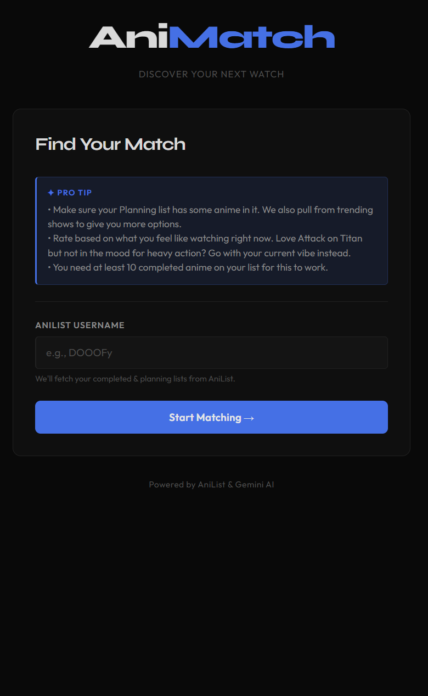
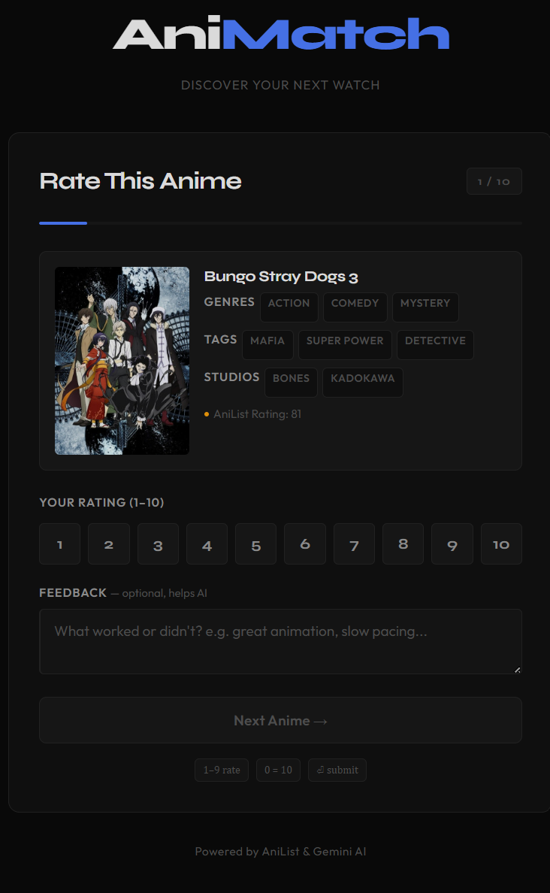
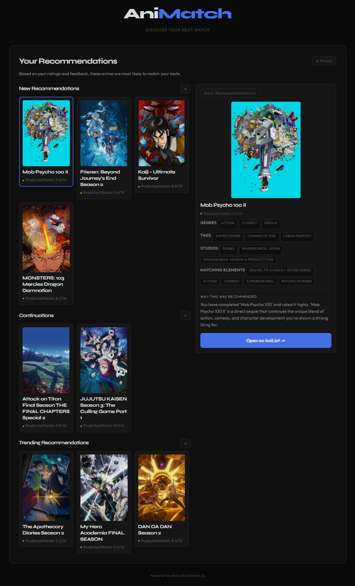

# 🎬 AniMatch

AI-powered anime recommendations tailored to your taste.  
Connect your AniList profile, rate a few shows, and let Gemini find the perfect next watch from your planning list, plus trending anime you might have missed.

## Features

- **AniList integration** – Fetches your completed, planning, and trending anime in one go.
- **Smart rating** – Rate 10 random completed shows (1-10) with optional feedback.
- **Three-way recommendations** – Get suggestions split into:
  - **Continuations** – Sequels to shows you rated highly.
  - **New discoveries** – Fresh titles from your planning list that match your taste.
  - **Trending picks** – Currently popular anime, filtered through your preferences.
- **Keyboard shortcuts** – Use number keys to rate and Enter to submit, no clicking needed.
- **Clickable cards** – Every recommendation opens its AniList page so you can add it instantly.
- **Dark theme** – Easy on the eyes for late-night browsing.

## How It Works

1. Enter your AniList username.
2. Rate 10 random shows from your completed list and be honest about your current mood.
3. Gemini analyzes your scores and feedback, looking at genres, studios, themes, and your own words.
4. The app returns:
   - Continuations of series you already love.
   - New recommendations from your planning list.
   - A few trending anime that fit your vibe.
5. Click any card to visit AniList and add it to your planning list.

## Tech Stack

- **Backend:** Python, Flask
- **AI:** Google Gemini API
- **Data:** AniList GraphQL API
- **Frontend:** HTML, Tailwind CSS, vanilla JavaScript
- **Hosting:** Render

## Live Demo

👉 [animematchai.onrender.com](https://animematchai.onrender.com)

> ⚡ The free tier may take a few seconds to wake up. Give it a moment.

## Screenshots

*Only needs the username*

*Rate 10 anime with keyboard shortcuts*

*Recommendations split into continuations, new discoveries, and trending picks*

## Credits

- Anime data: [AniList](https://anilist.co)
- AI brain: [Google Gemini](https://ai.google.dev)

## License

MIT - feel free to use, modify, and share.
